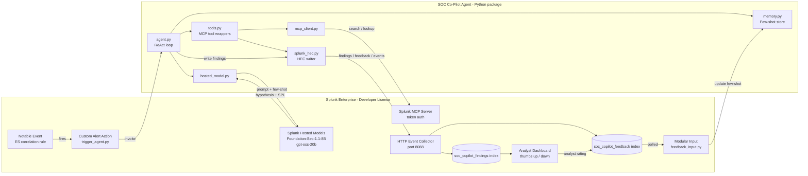

# SOC Co-Pilot — Architecture

## Data flow

1. **Trigger.** An Enterprise Security correlation rule fires and produces a notable.
   The notable's `alert_actions.conf` invokes `trigger_agent.py` (Splunk SDK custom
   alert action).
2. **Invocation.** `trigger_agent.py` reads the notable payload from stdin (Splunk's
   standard alert-action contract), serializes it, and shells out to the
   `soc-copilot triage` CLI entry point.
3. **Reasoning loop (ReAct).** `agent.py` runs a bounded loop:
   - Build prompt: notable + relevant few-shot examples from `memory.py`.
   - Call `hosted_model.py` → Splunk Hosted Models endpoint → Foundation-Sec response
     containing the next tool call.
   - Resolve tool call through `tools.py` → `mcp_client.py` → Splunk MCP Server.
   - Feed the tool result back into the next model turn.
   - Stop when the model emits a `final_report` action or `MAX_ITERATIONS` is reached.
4. **Write back.** The final report (hypothesis, severity, evidence SPL, recommended
   actions) is indexed into `soc_copilot_findings` through the **HTTP Event Collector**
   (`splunk_hec.py`, port 8088). HEC is used as the primary write transport because it
   traverses corporate firewalls without an 8089 management-port IP allowlist; the REST
   `receivers/simple` endpoint remains a fallback when the agent runs from an
   allowlisted network.
5. **Feedback ingestion.** The analyst dashboard writes 👍/👎 events into
   `soc_copilot_feedback` (also via HEC). The `feedback_input.py` modular input polls
   that index on a schedule, scores each past finding, and rewrites the few-shot memory
   file used by `memory.py` on the agent's next run.

## Connectivity modes

| Path | Port | Use |
|---|---|---|
| HTTP Event Collector | 8088 | Event ingest + findings/feedback write-back. Firewall-friendly; the only path that needs no IP allowlist. **Primary.** |
| Splunk Web / search | 443 | Analyst dashboard, ad-hoc SPL, App Inspect upload. |
| splunkd REST / MCP / Hosted Models / AI Toolkit | 8089 | Live AI reasoning + MCP tool calls. Requires the source IP to be allowlisted (Splunk Cloud ACS) — run the agent from an allowlisted network. |

On self-service Splunk Cloud stacks that ship only the `main` index, the HEC writer
transparently re-routes findings/feedback to `main` (preserving the intended index as
an `_intended_index` field) so the pipeline works with zero extra provisioning; create
the dedicated `soc_copilot_findings` / `soc_copilot_feedback` indexes and add them to
the HEC token to separate the streams.

## Security boundaries

- All credentials are read from environment variables (`.env`), never committed.
- The MCP Server uses bearer-token auth (OAuth not yet GA).
- The agent runs with the privileges of the Splunk service account; the alert action
  inherits Splunk's capability checks.
- Findings and feedback live in separate indexes so feedback poisoning can be detected
  and rolled back per-index.
